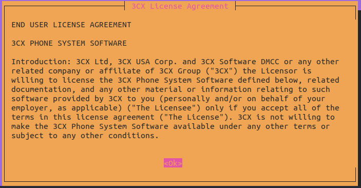
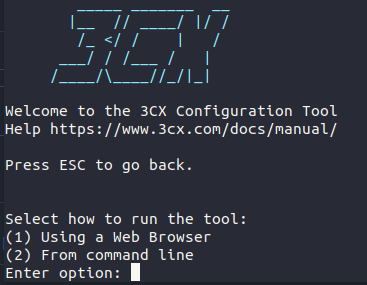

# Scripts 3CX

## 1) Instalação do 3CX no Debian 10 (Buster)

### 1.1) Execute o comando abaixo no Terminal do Servidor Linux

~~~script
sh -c "$(curl -fsSL https://raw.githubusercontent.com/it-brasil/3CX/master/install3cx.sh)"
~~~

### 1.2) Concorde com a licença do 3CX pressionando Enter

### 1.3) Digite 1 para continuar com o processo de instalação via navegador

### 1.4) Continue com o processo de instalação e configuração seguindo o guia da 3CX
#### [Primeira Configuração do 3CX](https://www.3cx.com.br/docs/manual/configurando-pabx/#h.8e3ybf57sm8n)